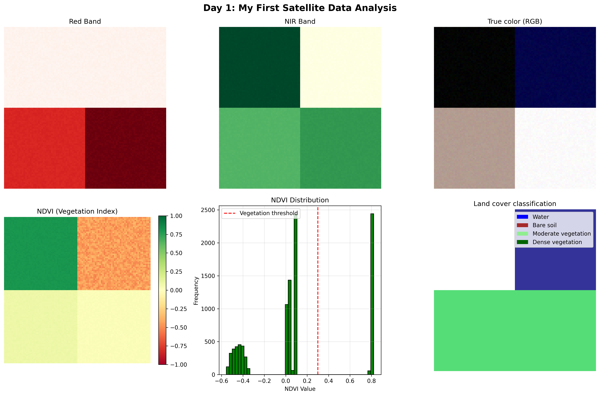

# Day 1 - March 12, 2026 

##📁 File Structure  
``` 
day01-first-satellite-analysis/
├── data/                    ← sample_sentinel2.tif
├── outputs/                 ← ndvi_result.tif, day1_ndvi_analysis.png
├── notebooks/
├── create_sample_data.py
├── ndvi_analysis.py
└── requirements.txt
```
## 🧑‍💻 Completed
- Satellite data theory: bands, GeoTIFF, spectral signatures (e.g., how a leaf reflects light from blue, green, red, to infrared)
- Built NDVI calculator from scratch (ndvi_analysis.py)
- Created synthetic Sentinel-2 data and ran analysis (create_sample_data.py)
- Understood: satellite image = grid of numbers, not a photo

## 📚Key Insight
Healthy plants are Bright in NIR (due to High Reflectance), Dark in Red (due to High Absorption).
This invisible difference is how we monitor crops from space.

## 🔳Outputs
- ✅Saved visualization: outputs/day1_ndvi_analysis.png
  
- ✅Saved NDVI as GeoTIFF: outputs/ndvi_result.tif

## ⛷️Skipped
- Streamlit deployment (scheduled for Day 6)
- LinkedIn post (will do shortly)

## 😎Confidence
- Satellite concepts: 8/10
- NDVI code: 8/10
- Git workflow: 6/10

## 🪦Tomorrow: Coordinate Reference Systems (CRS) 
- WGS84 vs UTM
- EPSG codes
- Projection converter tool
- PostGIS installation


