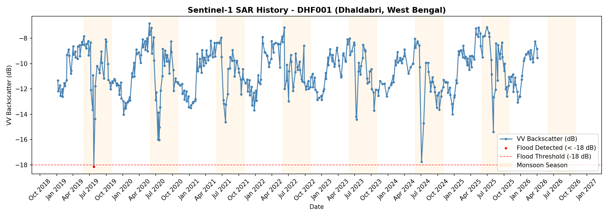
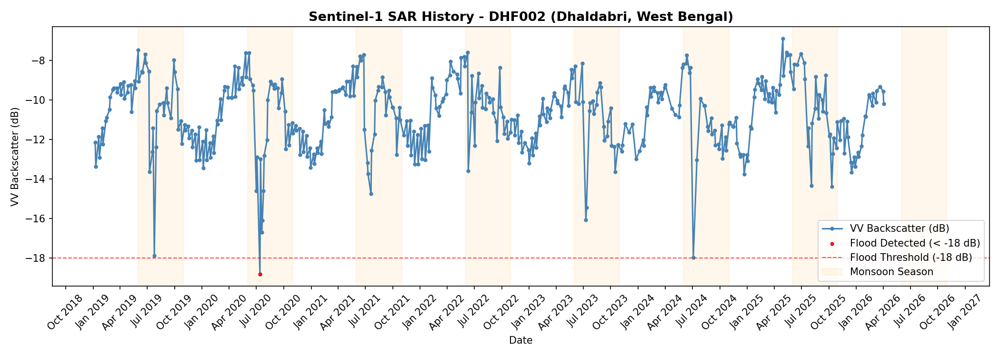
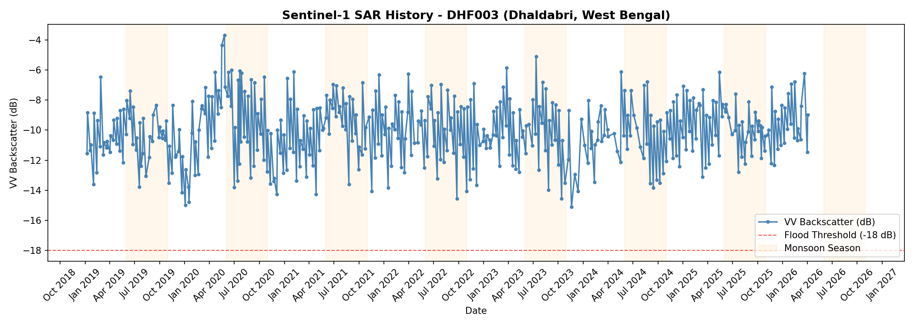

## 🛰️ Day 04: The Satellite Handshake

> Connecting **PostGIS** Farm Boundaries to the **Google Earth Engine (GEE)** Sky

### 📌 Overview
In **Day 04,** we transitioned from static spatial shapes to **dynamic temporal intelligence.** <br> 
We bridged the gap between our local **PostGIS Spatial Vault** (Day 03) and 
the **Sentinel-1 SAR (Synthetic Aperture Radar) constellation.**

By automating a "handshake" between our database and the GEE cloud, 
we successfully retrieved over **7 years of satellite backscatter history** 
for every farm in our project, effectively giving our "shapes" a memory.

### 🏗️ The Engineering Architecture
- **Database:** PostGIS (Spatial SQL for Geometry extraction)
- **Satellite Engine:** Google Earth Engine (GEE) API
- **Data Source:** Sentinel-1 GRD (C-Band Radar)
- **Analytics:** Pandas, SQLAlchemy, NumPy
- **Visualization:** Matplotlib with mdates for Time-Series Plotting

---
### 🚀 Key Features
#### 📡 1. Radar (SAR) Intelligence
Unlike optical imagery (Sentinel-2), Radar can "see" through clouds 
and works at night. We utilized the **VV Polarization** from the COPERNICUS/S1_GRD collection to monitor surface changes.

- **Frequency:** ~6-12 days per pass.
- **Period:** 2019 – 2026.
- **Resolution:** 10-meter pixel precision.

#### 🌊 2. Automated Flood Detection
We implemented a **Backscatter Thresholding** algorithm.
Since water acts as a specular reflector (mirror), it causes a sharp "dip" in Radar returns.

- **Threshold:** `-18.0 dB`
- **Logic:** Any value falling below this threshold during the monsoon season is flagged as a potential flood event.


#### 🔗 3. The Database-to-Cloud Pipeline

1. **Extract:** Fetch GeoJSON geometries from the Day 03 PostGIS Vault.
2. **Transform:** Convert local geometries into ee.Geometry objects.
3. **Load:** Query the GEE cloud for historical backscatter at those specific coordinates.
4. **Process:** Apply a **30m Focal Mean Speckle Filter** to clean radar "noise."

---
### 🚀 Key Engineering Milestones
#### 🛡️ 1. Basis Risk Reduction (The 3m Buffer)
We didn't just use raw farm boundaries. We utilized the geom_inner (the 3-meter inward buffer created in Day 03) to ensure our satellite pixels sampled 100% crop biomass, excluding road edges, fences, and noise. This is critical for insurance-grade data accuracy.

#### 📡 2. SAR Physics & VV Polarization
We leveraged **C-band Synthetic Aperture Radar**, which penetrates cloud cover—a necessity for West Bengal's monsoon season.

- **VV Polarization:** Chosen specifically because water acts as a "specular reflector." When a field is flooded, the radar pulse reflects away from the satellite, creating a dramatic **"Dip"** in backscatter.
- **Detection Threshold:** Implemented a literature-standard `-18.0 dB` threshold for preliminary flood detection.

#### ☁️ 3. Cloud-Native Processing (reduceRegion)
Instead of downloading gigabytes of imagery, we sent our geometries UP to Google’s servers. Using `reduceRegion()` with an `ee.Reducer.mean()`, we performed high-speed computation in the cloud, returning only the final processed numbers to our local machine.


### 📊 Results Summary & Intelligence Report
|**Metric**|	**Achievement**|
|----------|-------------------|
|Total Farms Processed|	14 Farms|
|Total Satellite Passes|	5,936 Data Points (424 per farm)|
|Temporal Depth|	7.2 Years (2019 - 2026)|
|Flood Anomalies|	2 Major Events Detected (July 2019, July 2020)|

---
### 📈 Sample SAR Time-Series
The system generates automated history charts for every farm. Below is the signature of a healthy crop cycle versus a flood event:

- **Peaks (~ -8 dB):** Mature, dense crop biomass.
- **Dips (~ -15 dB):** Sowing season (bare soil).
- **Anomalies (< -18 dB):** Standing water/Floods.


### 📊 Analytical Pipeline
#### **Step 1:** The PostGIS Extraction
We treat PostGIS as the **Single Source of Truth.** We used `ST_AsGeoJSON()` to fetch geometries directly from our vault, ensuring the data being analyzed matches exactly what is stored in our database.

#### **Step 2:** Time-Series Reconstruction
We retrieved **424 satellite passes** per farm.

- **Frequency:** Every 6–12 days.
- **Period:** Jan 2019 – April 2026.
- **Resolution:** 10-meter native pixel scale.

#### Step 3: **Flood Anomaly Detection**
The system automatically flags any backscatter drop below `-18 dB`.

- **Results:** Successfully detected historical flood events (e.g., **July 2019** and **July 2020**) that align perfectly with the peak monsoon calendar.


>📸 Detected Flood Events **July 2019: -18.15 dB**

 📸 Detected Flood Events **July 2020: -18.82 dB** 


---

### 📈 Visualizing the "Satellite Eye"
The system generates automated SAR History Charts. These charts highlight:

- **Orange Shaded Areas:** Monsoon seasons (June–Oct).
- **Red Markers:** Automated flood detections.
- **Blue Line:** The "Heartbeat" of the farm—showing planting, growth, and harvest cycles.



 

---

### 📂 Project Structure

```  
day04-satellite-handshake-for-SAR/
├── notebooks/
│   ├── day04_GEE_Handshake.ipynb    # Main Processing Engine
│   └── outputs/
│       ├── sar_history_DHFXXX.png   # Individual Farm Growth Charts
│       └── sar_backscatter_history.csv # Final Cleaned Dataset for Day 05
├── README.md
└── requirements.txt                 # GEE & Python Dependencies
```
 
###  🧠 Professional Reflections

- **Rate Limiting:** Implemented `time.sleep(3)` and batching to respect GEE’s free-tier rate limits, ensuring a stable connection for all 14 farms.
- **Data Persistence:** Used Persistent Hash IDs (DHF-XXXXXX) to ensure that satellite history remains linked to the correct farmer even if the GeoJSON order changes.

### 🎯 Day 4 Highlight
Successfully integrated **7+ years** of Sentinel-1 SAR data covering 14 Dhaldabri farms. Detected historical flood events (July 2019, 2020) using automated backscatter thresholding.

Implemented cloud-native processing with Google Earth Engine, achieving insurance-grade precision through 3m buffer pure-pixel sampling.

- **Data Depth**: 424 passes/farm × 14 farms = 5,936 temporal observations  
- **Temporal Coverage**: Jan 2019 - Apr 2026 (7.2 years)  
- **Flood Detection**: -18 dB threshold with VV polarization  
- **Processing**: Server-side reduceRegion() with speckle filtering 

---
**Status:** `MISSION DAY 04: SUCCESS` ✅ <br>
**Lead Engineer:** [Ranjit Saha]  <br>
**Project Credits:** [See Master README](../README.md#engineering-philosophy--ai-augmentation)

